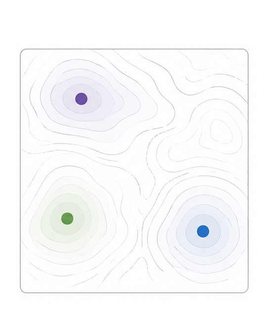
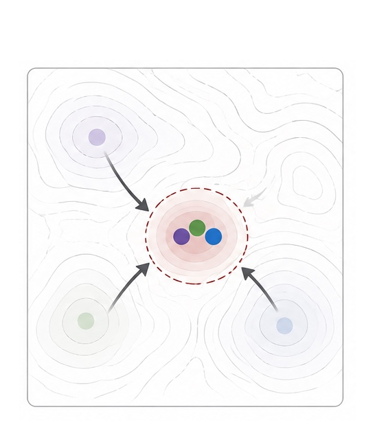
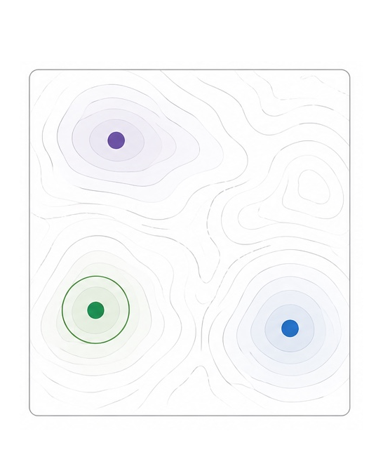
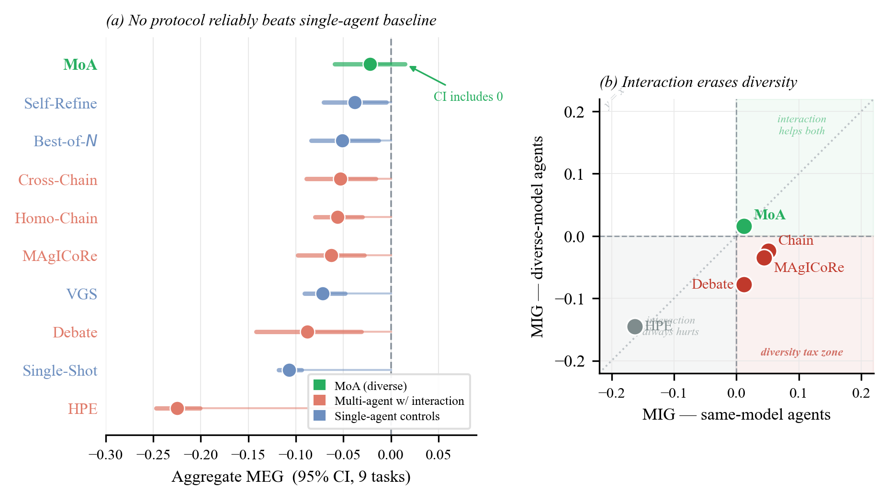

# The Interaction Tax: When Communication Erases Diversity in Multi-Agent Teams

Code and data for the paper. This is an empirical study of when multi-agent LLM interaction helps and when it hurts on scientific optimization tasks.

Different model families approach open problems with different inductive biases and find structurally different solutions. Each family is the top scorer on at least one task. But when agents read each other's complete outputs, their proposals converge within a single round, erasing the diversity that motivated using multiple models. We call this the *interaction tax*.

<p align="center">
  
  
  
</p>
<p align="center"><b>The interaction tax on optimization tasks.</b> Different model families (Claude, GPT-4o, Gemini) find structurally different solutions. When agents exchange full candidate solutions, their proposals converge and diversity is lost. When agents generate independently and the best is selected, diversity is preserved.</p>

<p align="center">
  
</p>
<p align="center"><b>(a)</b> Aggregate MEG for all ten configurations (95% CI, 9 tasks). No configuration reliably beats single-agent baselines. <b>(b)</b> MIG quadrant scatter. Chain, MAgICoRe, and Debate occupy the interaction tax zone (bottom-right), where full-solution interaction helps same-model agents but hurts diverse ones. MoA escapes to the top-right because its proposers never see each other's outputs.</p>

The repository contains a frozen testbed of 11 verifier-scored tasks, 10 agent configurations built from three model families (Claude Sonnet 4, GPT-4o, Gemini 2.5 Flash), all saved results, and the analysis scripts that reproduce every table and figure. All configurations share identical budget caps (200K tokens, 600s wall-clock, 25 visible-evaluator calls). Each (task, configuration) cell runs 5 seeds; the 2x2 factorial uses N=120 runs across 3 tasks.

## Key findings

**1. Diversity creates coverage, but only when proposals stay independent.**
Every same-model team has at least one task with Q=0. A diverse team (Claude + GPT-4o + Gemini) never scores zero on any task. The 2x2 factorial gives a diversity coefficient of +0.188 (CI [+0.073, +0.299], p<0.001). This finding is task-dependent: removing Erdos drops the coefficient to +0.014 with CI crossing zero.

**2. The interaction tax: same-model gains flip to diverse-model losses.**
Chain, MAgICoRe, and Debate all show positive same-model MIG (+0.051, +0.044, +0.012). Under diverse backbones, all three flip negative (-0.024, -0.035, -0.078), with bootstrap P(same > diverse) >= 97%. The only change between conditions is the model assignment, so the loss is consistent with diversity erased by full-solution interaction.

**3. MoA escapes because proposers never see each other's outputs.**
MoA's MIG stays positive from same-model to diverse (+0.012 to +0.016). It is the only configuration whose aggregate MEG confidence interval includes zero. The difference: MoA proposers generate independently, then a synthesizer picks or combines.

**4. Convergence is immediate, not gradual.**
Mean pairwise solution distance drops from 0.315 before interaction to 0.229 after. On Erdos, diverse Debate achieves a strong intermediate score at round 2 (critiques only) but regresses at round 3 once agents read each other's full solutions. Synthesis copies the best proposer's output >= 80% of the time on 5 of 7 tasks rather than recombining. Circle Packing is the one partial exception, where synthesis genuinely recombines proposals 60% of the time.

**5. Critique helps only when the fault is easy to locate.**
On Knapsack-50, where a weight violation is a simple arithmetic check, diverse Debate achieves 10/10 feasibility versus 2/10 for same-model. On 3AP-Free-100, where finding an arithmetic-progression triple requires reasoning over many combinations, diverse Debate drops to 0/10 versus 6/10 for same-model. On graded-feedback optimization tasks, the first critique round degrades solutions 57% of the time (17/30 runs).

**6. Hidden evaluation diverges from visible.**
Visible and hidden configuration rankings diverge on 3 of 9 optimization tasks (MaxCut, Difference Bases, Molecule QED). Hidden evaluators are stricter, more complete, or robustness-shifted, testing whether a solution found using the visible scorer holds up offline.

## What drives the tax

GPT-4o outputs an identical trivial constant on 100% of Erdos seeds (Q=0.710). Gemini produces near-trivial constants (all zeros). Only Claude generates structurally varied, non-trivial solutions. When a chain or debate includes GPT-4o on Erdos, the non-trivial solutions from Claude and Gemini are discarded in favor of a degenerate constant. Under independent generation (MoA-nosynth), the same three models produce raw scores of 2.47, 0.34, and 0.50; the best is selected, outperforming any single-backbone run.

The effective diversity of an ensemble depends on whether each backbone explores different regions of the solution space, not merely on the number of distinct model families.

## What's here

```
src/                Testbed, configuration, evaluator, and offline runner code (TypeScript)
analysis/           Analysis scripts that reproduce paper tables and summary files (Python)
scripts/            Figure-generation scripts (Python)
results/full-v2/    Saved JSON results (1605 files) for all task/configuration/seed cells
results/analysis/   Derived TSV tables used by the paper and robustness appendix
tools/evaluate.ts   Re-runs dev/hidden verifiers locally on saved results
figures/            Generated paper figures
CONFIGURATIONS.md   Exact mechanics of each agent configuration
```

## Tasks

| Task | Type | Direction | Domain |
|------|------|-----------|--------|
| MaxCut G(200,0.3) | Optimization | max | Graph theory |
| Circle Packing n=20 | Optimization | max | Geometry |
| Difference Bases | Optimization | max | Combinatorics |
| Flat Polynomials deg. 50 | Optimization | min | Algebra |
| TSP-100 | Optimization | min | Routing |
| LJ n=41 | Optimization | min | Chemistry |
| Erdos Overlap | Optimization | min | Analysis |
| Molecule QED | Optimization | max | Drug design |
| TSP-50 | Optimization | min | Routing |
| Knapsack-50 | Constraint | max | Combinatorics |
| 3AP-Free-100 | Constraint | max | Combinatorics |

Four optimization tasks (Circle Packing, Flat Polynomials, Difference Bases, Erdos Overlap) are adapted from the AlphaEvolve problem suite with smaller parameterizations and independent scoring implementations.

All tasks share the same interface: agents output JSON candidate solutions and deterministic verifiers return scalar scores. Tasks differ in feedback structure. On graded-feedback tasks (e.g., MaxCut, Circle Packing), almost every well-formed answer receives a meaningful score. On hard-validity tasks (Knapsack, 3AP-Free), a structural rule must be satisfied before the score is meaningful, and a small edit can violate the rule and collapse the score.

MaxCut and LJ-n=41 are omitted from most analyses because all configurations score Q=0 on both tasks under the given budget.

## Configurations

| Configuration | Type | Mechanism |
|---------------|------|-----------|
| Single-Shot | Baseline | One LLM call, no iteration |
| Best-of-N (N=8) | Baseline | 8 independent samples at temperatures 0.60-0.95, return visible-best |
| Self-Refine | Baseline | Same model generates, critiques, revises for 3 rounds |
| VGS | Baseline | Evolutionary loop (pop. 4, gen. 5, elite 2) with visible scores as fitness |
| Homo-Chain | Multi-agent | 4 same-model agents in sequence, each revises prior output |
| Cross-Chain | Multi-agent | 3-agent chain (Claude -> GPT-4o -> Gemini) |
| MAgICoRe | Multi-agent | Solver -> reviewer -> refiner, 2 rounds |
| Debate | Multi-agent | 2 agents propose, exchange critiques (2 rounds), synthesizer merges |
| HPE | Multi-agent | Planner decomposes, executors solve subproblems, integrator assembles |
| MoA | Multi-agent | 3 proposers generate independently, 1 synthesizer combines |

MoA is the only configuration where proposers never read each other's outputs. All configurations share the budget vector (T=200K tokens, W=600s, C=30s per call, K=25 evaluator calls). Selection rule: the artifact with the best dev score is submitted for hidden evaluation.

Appendix ablations: `moa-nosynth`, `moa-same-model`, and within-backbone variants (suffixed `-gpt4o`, `-gemini`) used in coverage, capability-confound, and factorial analyses.

## Key metrics

**MEG (Marginal Epistemic Gain)** measures whether a configuration beats the best single-agent baseline on hidden-evaluator scores:

```
MEG(p, t) = Q_hidden(p, t) - max_{c in C} Q_hidden(c, t)
```

where C = {Self-Refine, Best-of-N, VGS}. Positive MEG means the configuration outperforms the strongest single-agent baseline. No configuration achieves positive aggregate MEG.

**MIG (Marginal Interaction Gain)** measures whether the interaction step adds value over running the same agents independently without communication:

```
MIG(p, t) = Q_hidden(p, t) - Q_hidden(parallel(A), t)
```

Positive MIG means interaction helped; negative means it hurt. The diverse parallel baseline is inherently stronger because it benefits from coverage, so negative diverse MIG is a conservative finding.

**Q-normalization** maps raw scores to a common [0, 1] scale: `Q(s) = (s - b) / (r - b)`, clipped to [0, 1], where `b` is the trivial-solution baseline and `r` is the best known result.

## Step 1: Install dependencies

```bash
# Requires Node.js >= 20 and Python >= 3.10
npm install
pip install -r requirements.txt
```

No API keys needed for steps 2 and 3.

## Step 2: Verify the saved scores

Each task has two evaluators. The **dev evaluator** is the one agents can call during their runs to guide search. The **hidden evaluator** is a stricter variant agents never see; all paper results are based on hidden scores. Both are embedded as Python code in `src/tasks/benchmark-challenges.ts` and run locally as subprocesses.

```bash
# Verify hidden scores for one task
npx tsx tools/evaluate.ts --results results/full-v2 --task bench-maxcut-g200 --verifier hidden

# Verify dev scores for one task
npx tsx tools/evaluate.ts --results results/full-v2 --task bench-maxcut-g200 --verifier dev

# Verify both evaluators across all tasks (~20 minutes)
npx tsx tools/evaluate.ts --results results/full-v2 --verifier both
```

The output is a table of recorded vs. recomputed scores. They should match exactly.

## Step 3: Reproduce the paper tables and figures

```bash
# MEG table (aggregate and per-task)
python analysis/analyze_bench.py
# -> results/analysis/meg_full.tsv

# MIG by configuration and backbone
python analysis/analyze_mig.py
# -> results/analysis/mig_extended.tsv

# 2x2 factorial: diversity vs. synthesis coefficients
python analysis/analyze_2x2_hierarchical.py
# -> results/analysis/2x2_hierarchical.tsv

# Convergence: pairwise solution distances
python analysis/analyze_convergence.py

# Robustness: jackknife leave-one-task-out, denominator sensitivity
python analysis/analyze_robustness.py
# -> results/analysis/jackknife_meg.tsv, meg_denom_sensitivity.tsv

# MEG denominator bias correction
python analysis/analyze_meg_bias.py
# -> results/analysis/meg_bias_correction.tsv

# Proxy-sensitivity: visible/hidden mismatch sweep
python analysis/analyze_mismatch_sweep.py
# -> results/analysis/mismatch_sweep.tsv

# Dev/hidden rank agreement per task
python analysis/dev_hidden_rank_analysis.py
# -> results/analysis/rank_core.tsv, rank_all.tsv

# Figure 1: AggMEG lollipop + MIG quadrant scatter
python scripts/make_paper_fig1_combined.py
# -> figures/paper_fig1_combined.{pdf,png}

# Figure 2: 2x2 coefficients + cross-synthesizer robustness
python scripts/make_paper_figures.py
# -> figures/paper_fig2_mechanism.{pdf,png}
```

## Step 4: Re-run experiments from scratch (optional)

Re-running requires an `OPENROUTER_API_KEY`. Add it to `.env` (copy from `.env.example`).

```bash
# Full testbed: 11 tasks, 10 core configurations, 5 seeds each
npx tsx src/runner/run-offline.ts

# Single task and configuration, 3 seeds
npx tsx src/runner/run-offline.ts --task bench-difference-bases --protocol moa --seeds 1,2,3

# Validate config without spending tokens
npx tsx src/runner/run-offline.ts --dry-run
```

Both dev and hidden evaluation run as local Python subprocesses. No platform account needed. Results are written to `results/offline/`.

## Replication note

The original hidden-evaluator runs used a remote service that kept the hidden verifier server-side so agents could not inspect it during search. In this release, both dev and hidden verifiers are embedded directly in `src/tasks/benchmark-challenges.ts`, so all scores can be checked locally. Step 2 above confirms that the saved scores match those local verifiers.

Re-running experiments from scratch (Step 4) will produce numerically similar but not identical results. LLM outputs are stochastic: the same prompt with the same model may return different text across API calls, even at temperature 0, due to non-determinism in serving infrastructure. Aggregate MEG values across seeds are expected to fall within the 95% confidence intervals reported in the paper, but exact point estimates will vary. The saved results in `results/full-v2/` are the canonical numbers the paper reports.

## Result file format

Each file in `results/full-v2/` is named `bench-{task}_{configuration}_s{seed}.json`:

```json
{
  "taskId": "bench-difference-bases",
  "protocolId": "moa",
  "seed": 1,
  "bestArtifact": { "solutionData": {}, "devScore": 5.2, "rawOutput": "..." },
  "budgetTrace": { "tokenUsage": {}, "wallClockMs": 45000, "evalCalls": [] },
  "hiddenScore": 3.1
}
```

## License

MIT
